<!-- 

 -->

  

 

### 🧠 About

Computer Science student who likes making things work end-to-end — from training a classifier on Indonesian batik patterns, to building a chatbot for my own university, to running AI tools on a home server I set up myself. I currently teach practicum sessions in AI, Web Technology, and Distributed Databases, and spend my free time tinkering with self-hosted infrastructure and Linux.

 

### ⚡ What I'm Up To

- 🔭 Working on several **freelance projects** and building **side projects**
- 🌱 Currently learning **AI infrastructure, self-hosting, and Docker**
- 🏠 Running a **self-hosted AI stack** on my home server 
- 🎓 Teaching practicum sessions in **AI, Web Tech, and Distributed Databases**
- 🎮 Building a **Discord bot** for my community

 

### 🚀 Featured Projects

<table>
  <tr>
    <td width="50%" valign="top">
      <h4>🤖 academic-service-chatbot</h4>
      
RAG chatbot for university queries — my undergrad thesis project

      

        
        
        
      

    </td>
    <td width="50%" valign="top">
      <h4>🎨 batik-motif-classification</h4>
      
ML classifier for traditional Indonesian batik motifs

      

        
        
        
      

    </td>
  </tr>
  <tr>
    <td width="50%" valign="top">
      <h4>👁️ cvision-ai</h4>
      
Real-time object detection with a modern web UI

      

        
        
      

    </td>
    <td width="50%" valign="top">
      <h4>🏠 personal-ai-infra-stack</h4>
      
Self-hosted LLM + vector DB pipeline on my home server

      

        
        
        
      

    </td>
  </tr>
  <tr>
    <td width="50%" valign="top">
      <h4>🎮 unpak-discord-bot</h4>
      
Academic + entertainment bot for my student community

      

        
        
      

    </td>
    <td width="50%" valign="top">
      <h4>📱 ngalalana</h4>
      
Gamified mobile app for learning Sundanese script

      

        
        
      

    </td>
  </tr>
</table>

more on **[raihanzaky.my.id](https://raihanzaky.my.id)**

 

### 🛠️ Stack & Tools

 

###